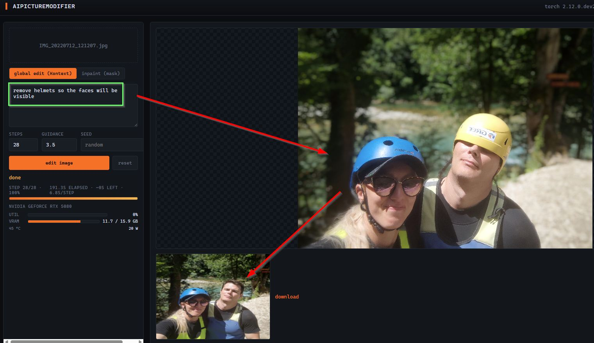
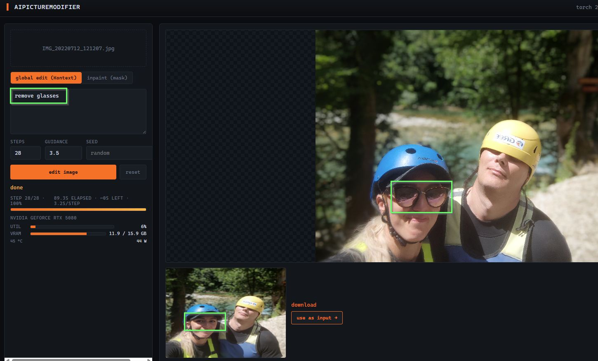
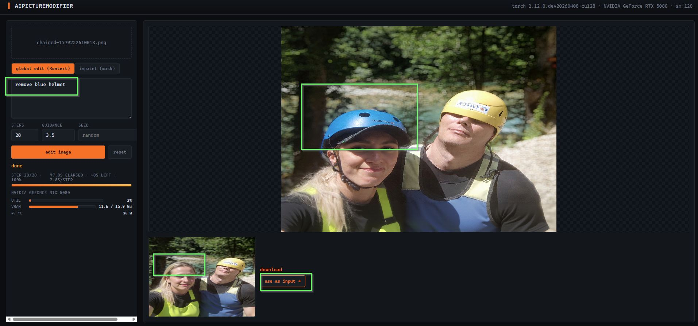

# AiPictureModifier

[](https://github.com/Jakub-Syrek/AiPictureModifier/actions/workflows/ci.yml)
[](LICENSE)
[](https://www.python.org/)
[](https://pytorch.org/get-started/locally/)
[](https://github.com/astral-sh/ruff)
[](https://docs.astral.sh/ruff/formatter/)
[](https://github.com/pre-commit/pre-commit)
[](https://hypothesis.works/)

Web app for prompt-driven image editing with FLUX, sized for an RTX 5080
(Blackwell · sm_120 · 16 GB).

- **Global edit** — FLUX.1 Kontext: keeps composition, follows instructions.
- **Inpaint** — FLUX.1 Fill: regenerates a painted mask region only.

For prompt patterns, mode selection guide, and iteration workflow, see
**[README.tech.md](README.tech.md)**.

## Screenshots

### UI overview



Left panel: file dropzone, mode toggle, prompt, params (steps / guidance
/ seed), action buttons, live progress bar, GPU telemetry pulled from
`nvidia-smi` every 500 ms. Right panel: input canvas, result image, and
the `use as input →` chain button.

This run is also a useful illustration of where Kontext's text-only
attention can struggle: the prompt `remove helmets so the faces will
be visible` is partially executed — the model preserved the subjects
but couldn't fully resolve the self-occlusion of the helmets without
3D reasoning about the missing face geometry. Inpaint with a mask is
the cleaner path for this class of edit (see `README.tech.md`).

### Chained edits — `remove glasses` → `remove blue helmet`

A real-world iteration loop: edit, click `use as input →`, write the
next instruction. Each run takes ~80 s on an RTX 5080 with NF4
(~2.8–3.2 s/step after warmup). The result of step 1 becomes the input
for step 2 — no re-uploading.



*Step 1 — `remove glasses`. Input is a photo of two people in rafting
helmets; the woman is wearing sunglasses. Kontext removes them cleanly,
preserves the rest of the composition. 28 steps, 89.3 s, 3.2 s/step.
VRAM 11.9 / 15.9 GB resident, no PCIe thrashing.*



*Step 2 — clicked `use as input →` (input filename now reads
`chained-1779222610013.png`), then `remove blue helmet`. The result of
step 1 is now the input. Kontext replaces the helmet with plausible
hair blended into the existing face. 28 steps, 77.8 s, 2.8 s/step.*

The whole sequence (load photo → step 1 → chain → step 2 → result):
under 3 minutes of wall time. The seed of each run is preserved in the
seed field for further A/B iteration on the same composition.


## Setup

The 5080 needs PyTorch nightly **cu128** — stable PyTorch ships kernels only
up to sm_90 and will fall back to CPU. `scripts/setup.py` detects the card
and picks the right wheel.

```powershell
python -m venv .venv
.venv\Scripts\Activate.ps1
python scripts\setup.py
```

You'll also need a Hugging Face token with access granted to
[`FLUX.1-Kontext-dev`](https://huggingface.co/black-forest-labs/FLUX.1-Kontext-dev)
and [`FLUX.1-Fill-dev`](https://huggingface.co/black-forest-labs/FLUX.1-Fill-dev):

```powershell
hf auth login
```

(Older docs say `huggingface-cli login` — that command is deprecated in
`huggingface_hub` ≥ 1.0; use `hf` instead.)

## Run

```powershell
python backend\server.py
```

Open <http://127.0.0.1:8000>. First request downloads model weights (~24 GB
each) into the HF cache.

## 4-bit quantization (recommended on 16 GB cards)

Without quantization, Flux Kontext + T5-XXL is ~21 GB in bf16, doesn't fit
in a 5080's 16 GB VRAM, and `enable_model_cpu_offload` streams the model
across PCIe every step — observed ~230 s/step at 512 px input. The GPU
sits at ~65 W (vs 360 W TDP) waiting for transfers.

NF4 (bitsandbytes) drops the transformer to ~3.5 GB and T5 to ~3 GB. The
whole pipeline fits in VRAM, cpu_offload is disabled, and the card actually
computes. Expected speedup: ~30×, modest quality loss limited to fine
textures, smooth gradients, and image text — for typical Kontext edits
(replace/remove/restyle) the difference isn't visible.

Enable per-run:

```powershell
$env:FLUX_QUANT = "4bit"
python backend\server.py
```

`GET /api/health` shows `"quant": "4bit"` when active. Unset the env var
to revert to the bf16 baseline.

## Performance (measured on RTX 5080 · 16 GB, 4000×3000 input → 512 px)

| metric             | bf16 + cpu_offload   | NF4 (resident)     |
|--------------------|----------------------|--------------------|
| transformer VRAM   | 12 GB (streamed)     | 3.5 GB (resident)  |
| T5-XXL VRAM        | 9 GB (streamed)      | 3 GB (resident)    |
| peak VRAM          | 15.4 / 15.9 GB (cap) | 14.0 / 15.9 GB     |
| power draw         | 65 W                 | 245 W              |
| step time          | 232 s                | 6.9 s              |
| total (28 steps)   | ~108 min             | 193 s              |
| **speedup**        | baseline             | **~33×**           |

## Architecture

```
frontend/                browser, no framework — Canvas + Pointer Events
├── index.html           upload, prompt, mode toggle, mask brush, progress + GPU panel
├── app.js               polling at 2 s idle / 500 ms during edit
└── styles.css           dark terminal theme, single accent color

backend/
├── server.py            FastAPI app — /api/health, /api/progress, /api/edit
├── pipeline.py          FluxEditor (lazy), AccelConfig, EditRequest,
│                        bf16/NF4 dispatch, diffusers callback wiring
├── progress.py          JobProgress singleton + nvidia-smi GpuStats parser
└── imgutils.py          pure helpers (RGB/L conversions, fit_long_edge, PNG bytes)

scripts/
└── setup.py             Blackwell-aware installer (PyTorch nightly cu128)

tests/                   pytest + Hypothesis property tests + TestClient smoke
├── conftest.py          torch stub for torch-free CI
├── test_imgutils.py     unit tests for pure helpers
├── test_imgutils_properties.py  property-based invariants for fit_long_edge
├── test_progress.py     JobProgress lifecycle + nvidia-smi parser edge cases
├── test_accel_config.py AccelConfig.from_env
├── test_quant_mode.py   _read_quant_mode env var parsing
└── test_server.py       /api/edit + /api/progress via TestClient with stubbed editor
```

### Design choices worth knowing

- **Lazy pipeline loading.** `FluxEditor` properties build the pipeline on
  first access — server startup is fast, model load happens with the first
  edit request.
- **Async-safe inference.** `/api/edit` wraps the synchronous
  `editor.edit()` in `asyncio.to_thread` so the event loop stays free to
  serve `/api/progress` polls concurrently.
- **Diffusers callback.** `callback_on_step_end` writes step counts into a
  module-level `JobProgress` singleton — no queue, no IPC, single
  concurrent edit by design.
- **Round-trip resize.** Inputs are downscaled to `FLUX_MAX_EDGE` for
  inference (default 512), then LANCZOS-upscaled back to upload
  dimensions before response. Detail is bounded by Flux's latent
  resolution either way.
- **NF4 quantization is opt-in.** Default behavior is bf16 + cpu_offload
  so the project runs out of the box on any 12+ GB card. Set
  `FLUX_QUANT=4bit` to unlock the 30× speedup on 16 GB.
- **Acceleration LoRA is opt-in.** `FLUX_ACCEL_REPO` + `_WEIGHT` + `_SCALE`
  env vars fuse a Hyper-SD / Flux-Turbo LoRA into both pipelines at load
  time. Cuts step count from ~28 to ~8 with a modest quality tradeoff.

## Development

```powershell
pip install pre-commit
pre-commit install
pre-commit run --all-files
pytest -q
```

Tests run torch-free (a stub is installed in `tests/conftest.py`), so
`pytest -q` works without the multi-gigabyte GPU stack — useful when
iterating on routing or pure helpers.

### CI gates (every push and PR)

- ruff lint
- ruff format check
- `compileall` syntax check
- pytest with `pytest-cov`, coverage floor enforced (`--cov-fail-under=80`)
- Hypothesis property tests for `fit_long_edge`
- Matrix: Python 3.11 / 3.12 × Ubuntu / Windows
- Bandit static security analysis (backend + scripts)
- pip-audit dependency CVE scan
