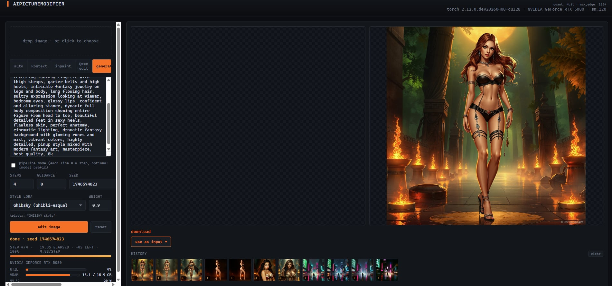
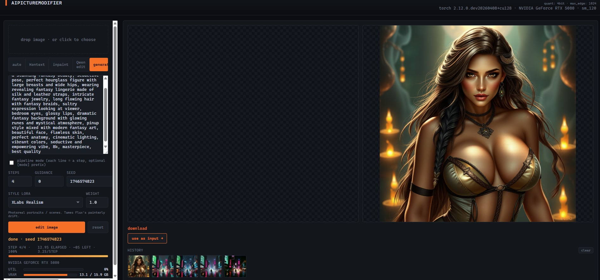

# TensorForge

[](https://github.com/Jakub-Syrek/TensorForge/actions/workflows/ci.yml)
[](LICENSE)
[](https://www.python.org/)
[](https://pytorch.org/get-started/locally/)
[](https://github.com/astral-sh/ruff)
[](https://docs.astral.sh/ruff/formatter/)
[](https://github.com/pre-commit/pre-commit)
[](https://hypothesis.works/)

A local creative ML image workstation, single-GPU optimized for the RTX 5080
(Blackwell · sm_120 · 16 GB VRAM under NF4 quantization). One web UI,
twelve specialized models cooperating: FLUX.1-Kontext for instruction edits,
FLUX.1-Fill for masked inpainting and outpainting, FLUX.1-schnell for
text-to-image, Qwen-Image-Edit as an alternative editor, **ControlNet
Union-Pro** for pose/depth/canny conditioning, **IP-Adapter** for
image-as-prompt style transfer, **PuLID** for face-identity preservation,
**Real-ESRGAN** for learned 4× upscaling, **BiRefNet** for background
removal, **BLIP-large / BLIP-2** for captioning, **DETR / OWLv2 / CLIPSeg**
for object detection and text-prompted segmentation, **Qwen2.5-1.5B** for
prompt rewriting, plus a five-LoRA style registry stackable via diffusers'
multi-adapter API.

<p align="center">
  
</p>

For prompt patterns, mode selection guide, and iteration workflow, see
**[README.tech.md](README.tech.md)**.

---

## Showcase

Two variants of the same prompt — different seeds, identical pipeline.
Multi-subject composition (rider + dragon + landscape) in a single
FLUX schnell pass with the Tarot style LoRA stacked on top of the
acceleration LoRA.

<p align="center">
  
  &nbsp;
  
</p>

---

## Capabilities

| Capability | Backend model | What it's for |
|---|---|---|
| **Generate** | FLUX.1-schnell (4-step distilled) | text→image from scratch |
| **Edit** | FLUX.1-Kontext-dev | instruction edits that keep composition |
| **Inpaint** | FLUX.1-Fill-dev | regenerate a painted region only |
| **Outpaint** | FLUX.1-Fill-dev (canvas extension) | extend an image beyond its original bounds |
| **Qwen edit** | Qwen-Image-Edit | alternative instruction edit (Qwen2-VL text encoder) |
| **ControlNet** | Shakker-Labs FLUX.1-dev-ControlNet-Union-Pro | pose / depth / canny conditioning |
| **IP-Adapter** | InstantX FLUX.1-dev-IP-Adapter | image-as-prompt style/composition reference |
| **PuLID** | guozinan PuLID-FLUX-v0.9.1 + InsightFace | face-identity preservation across stylization |
| **Real-ESRGAN** | RealESRGAN_x4plus via spandrel | learned 4× upscaling (synthesizes detail) |
| **Background removal** | BiRefNet-general via rembg | isolate subject on transparent canvas |
| **Auto-mask** | CIDAS/clipseg-rd64-refined | text-prompted segmentation ("the sky", "her coat") |
| **Object detect (generic)** | facebook/detr-resnet-50 | 91 COCO classes |
| **Object detect (text-grounded)** | google/owlv2-base-patch16-ensemble | "find me the dragon" |
| **Fast caption** | Salesforce/blip-image-captioning-large | single-sentence scene description |
| **Deep caption** | Salesforce/blip2-opt-2.7b | multi-sentence with spatial relations |
| **Prompt rewriter** | Qwen/Qwen2.5-1.5B-Instruct | short prompt → verbose FLUX-style description |
| **Style LoRAs** | 5 built-in (Realism / Koda / Tarot / Ghibsky / Anime) | aesthetic preset, stackable with accel LoRA |
| **Pipelines** | sequential N-step chains | `[generate] → [auto_mask] → [inpaint]` workflows |

All models are **lazy-loaded** on first use — booting the server is fast;
you pay the download / VRAM cost only for features you actually click.

---

## Setup

The 5080 needs PyTorch nightly **cu128** — stable PyTorch ships kernels only
up to sm_90 and will fall back to CPU. `scripts/setup.py` detects the card
and picks the right wheel.

```powershell
python -m venv .venv
.venv\Scripts\Activate.ps1
python scripts\setup.py
```

You'll also need a Hugging Face token with access granted to
[`FLUX.1-Kontext-dev`](https://huggingface.co/black-forest-labs/FLUX.1-Kontext-dev),
[`FLUX.1-Fill-dev`](https://huggingface.co/black-forest-labs/FLUX.1-Fill-dev),
and [`FLUX.1-dev`](https://huggingface.co/black-forest-labs/FLUX.1-dev)
(the last only needed if you use ControlNet or PuLID):

```powershell
hf auth login
```

(Older docs say `huggingface-cli login` — that command is deprecated in
`huggingface_hub` ≥ 1.0; use `hf` instead.)

PuLID also needs `insightface`:

```powershell
.venv\Scripts\python -m pip install insightface
```

---

## Run

Use the launcher script to pick a performance profile:

```powershell
scripts\launch.ps1                  # 'fast' profile (NF4, default)
scripts\launch.ps1 -Profile hyper   # NF4 + Hyper-SD 8-step LoRA
scripts\launch.ps1 -Profile quality # bf16, slow but maximum fidelity
scripts\launch.ps1 -Help            # print the profile comparison table
scripts\launch.ps1 -KillExisting    # take over port 8000 if a stale server
                                    #   is still bound
```

Or call the server directly if you want to manage env vars yourself:

```powershell
python backend\server.py
```

Open <http://127.0.0.1:8000>. Each feature downloads its weights on first
click into the HF cache.

---

## Style LoRAs

A style LoRA is a small adapter (~150-300 MB) that biases the base FLUX
model toward a specific aesthetic. The base checkpoint is shared; only
the LoRA delta swaps in. Pick one from the dropdown above the run button —
combines cleanly with the acceleration LoRA so you can still run 8-step
"fast fantasy" mode.

<p align="center">
  
</p>

<p align="center">
  
</p>

Built-in registry (extend in `backend/loras.py` or `backend/loras.json`):

| id        | label              | best for                                      | trigger word                                |
|-----------|--------------------|-----------------------------------------------|---------------------------------------------|
| realism   | XLabs Realism      | photoreal sci-fi (mecha, EVA suits, station)  | —                                           |
| koda      | Koda (analog film) | cinematic, Tarkovsky-Solaris vibe             | `flmft style`                               |
| tarot     | Tarot card         | ornate fantasy, mystical, symbolic            | `in the style of TOK a trtcrd tarot style`  |
| ghibsky   | Ghibsky            | cosy-fantasy landscapes, Ghibli-esque         | `GHIBSKY style`                             |
| anime     | Synthetic Anime    | anime/manga keyframes, character art          | —                                           |

Adapter weight `1.0` matches training. Drop to `0.7-0.8` if style dominates
semantics; push to `1.1-1.2` if barely visible; above `1.3` anatomy breaks.
LoRAs apply to `generate` and `kontext` only — `inpaint` and `qwen` ignore
the selection by design (different architecture / use case).

Requires `peft >= 0.13` in your venv (`pip install peft`).

In pipeline mode each step can override the LoRA inline:

```
[generate|tarot] knight in stormy landscape
[kontext|ghibsky] make it golden hour, soft cumulus clouds
[kontext|realism] add subtle film grain and chromatic aberration
```

`[mode|lora]` — leave either side empty (e.g. `[|tarot]`) to keep the
default for that slot.

---

## ControlNet — compositional control

Spatial conditioning via Shakker-Labs FLUX.1-dev-ControlNet-Union-Pro,
one checkpoint that handles canny / depth / pose via the ``union_mode``
selector. Upload a pre-processed conditioning map (canny edges, depth,
or OpenPose skeleton), the model follows that geometry while filling
in style + texture from your prompt.

```
control_type:    canny | depth | pose
control_scale:   0.4 (loose) ... 0.7 (default) ... 1.0 (tight)
```

We deliberately don't preprocess server-side — keeps the dep tree light.
Use [controlnet_aux](https://github.com/huggingface/controlnet_aux) or a
ComfyUI preprocessor node to make the conditioning map.

Cost: ~30 GB on disk (FLUX.1-dev base + Union-Pro), ~8 GB VRAM under NF4.

---

## IP-Adapter — image-as-prompt

Drop a Frank Frazetta painting / a film still / a concept art — FLUX
inherits its visual style and composition from that image alongside the
verbal prompt. Useful for aesthetics that resist verbal description.

Lives in its own row above the style LoRA dropdown. Default weight 0.7;
stacks cleanly with style LoRAs and ControlNet for three independent
conditioning layers (semantic / structural / visual).

Cost: ~1 GB additional VRAM after warm.

---

## PuLID — face identity preservation

Upload a face photo, prompt drives the scene, FLUX keeps the face
recognizable through any stylization. "Cyberpunk version of me",
"fantasy knight version of me", "anime version of me" — all with YOUR
face, not a generic interpretation of the prompt.

- InsightFace (RetinaFace + ArcFace) extracts a 512-dim identity vector
- PuLID-FLUX injects it at every denoising step via cross-attention
- `id_strength` 0.7 = strong stylization + recognizable face; 1.2 = faithful face, lighter style

Cost: ~7 GB VRAM under NF4, ~25 GB disk (FLUX.1-dev shared with
ControlNet + PuLID weights + InsightFace bundle).

---

## Real-ESRGAN upscaling

Replaces the default LANCZOS round-trip with a learned 4× upscaler.
LANCZOS interpolates pixels; Real-ESRGAN **synthesizes** texture detail
(skin pores, fabric weave, distant foliage) at the high resolution
before any downsampling smooths it.

Toggle via the `upscale` dropdown in the params row (`lanczos` vs
`real-esrgan 4x`). Tile-based inference keeps peak VRAM under ~3 GB
even on 4K outputs.

Cost: ~67 MB weights, ~600 MB VRAM resident.

---

## Scene analysis

After uploading an image, the **analyze scene** row reveals two buttons:

- **fast analyze** — BLIP-large caption (single sentence) + DETR object
  chips. ~0.9 GB VRAM, ~1 s on a warm model.
- **deep analyze** — BLIP-2 OPT-2.7B caption (multi-sentence with spatial
  relations) + same chips. ~5.4 GB VRAM, slower first-load.

Clicking any chip inserts that label into the prompt textarea — handy
for "replace the X with Y" edits where you don't know FLUX's preferred
vocabulary.

The same row holds a **remove bg** button (BiRefNet via rembg, CPU,
~1-2 s, zero VRAM cost) that swaps your input image for a transparent
cutout — feed it straight into FLUX Fill with a new backdrop prompt.

---

## Prompt rewriter

A small ✨ **expand** button overlays the prompt textarea. Click → Qwen2.5-1.5B-Instruct
rewrites your short input ("knight in forest") into a verbose FLUX-style
caption ("a battle-scarred medieval knight in ornate gothic plate armor
holding a runed greatsword, standing in a misty pine forest at dawn,
volumetric god rays through the canopy, golden hour rim light, 35mm
anamorphic, shallow depth of field, photoreal cinematic").

Replacement is recorded in the textarea undo stack — **Ctrl+Z brings
the original short prompt back** if you don't like the expansion.

Cost: ~3 GB bf16 VRAM, ~0.5-2 s per expansion on a warm model.

---

## Pipelines — sequential chains

Toggle **pipeline mode** under the prompt. Each non-empty line becomes a
separate step that runs on the previous step's output. Optional
`[mode|lora]` prefix forces the model and style per line.

```
[generate|tarot] knight in stormy mountain pass
[auto_mask] the knight
[inpaint] in obsidian cyborg armor with neon glow
```

`auto_mask` is special — runs CLIPSeg's text-prompted segmentation on the
previous step's output, attaches the mask to the next step. So the
example above generates a knight via tarot-styled schnell, segments him,
and inpaints cyborg armor over the segmented region.

---

## 4-bit quantization (recommended on 16 GB cards)

Without quantization, FLUX Kontext + T5-XXL is ~21 GB in bf16, doesn't fit
in a 5080's 16 GB VRAM, and `enable_model_cpu_offload` streams the model
across PCIe every step — observed ~230 s/step at 512 px input. The GPU
sits at ~65 W (vs 360 W TDP) waiting for transfers.

NF4 (bitsandbytes) drops the transformer to ~3.5 GB and T5 to ~3 GB. The
whole pipeline fits in VRAM, cpu_offload is disabled, and the card
actually computes. Expected speedup: ~30×, modest quality loss limited
to fine textures, smooth gradients, and image text — for typical edits
the difference isn't visible.

Enable per-run:

```powershell
$env:FLUX_QUANT = "4bit"
python backend\server.py
```

`GET /api/health` shows `"quant": "4bit"` when active.

---

## Performance (RTX 5080 · 16 GB, 4000×3000 input → 512 px)

| metric             | bf16 + cpu_offload   | NF4 (resident)     |
|--------------------|----------------------|--------------------|
| transformer VRAM   | 12 GB (streamed)     | 3.5 GB (resident)  |
| T5-XXL VRAM        | 9 GB (streamed)      | 3 GB (resident)    |
| peak VRAM          | 15.4 / 15.9 GB (cap) | 14.0 / 15.9 GB     |
| power draw         | 65 W                 | 245 W              |
| step time          | 232 s                | 6.9 s              |
| total (28 steps)   | ~108 min             | 193 s              |
| **speedup**        | baseline             | **~33×**           |

---

## Architecture

```
frontend/                browser, no framework — Canvas + Pointer Events
├── index.html           upload, prompt, mode toggle, mask brush, progress + GPU panel
├── app.js               polling at 2 s idle / 500 ms during edit
└── styles.css           dark terminal theme, single accent color

backend/
├── server.py            FastAPI app — /api/tasks, /api/vision/*, /api/prompt/expand
├── pipeline.py          FluxEditor (Kontext / Fill / Qwen / schnell), NF4 dispatch,
│                        multi-adapter LoRA stacking (accel + style + IP-Adapter)
├── controlnet.py        FluxControlNetPipeline + Union-Pro (separate, lazy)
├── pulid.py             FLUX.1-dev + PuLID weights + InsightFace (separate, lazy)
├── vision.py            BLIP-large / BLIP-2 / DETR / OWLv2 / CLIPSeg (all lazy)
├── bg_remove.py         BiRefNet via rembg (CPU, ONNX runtime)
├── prompt_rewriter.py   Qwen2.5-1.5B-Instruct (lazy)
├── upscale.py           RealESRGAN_x4plus via spandrel (tile-based)
├── loras.py             style LoRA registry + multi-adapter glue
├── worker.py            single-thread task queue, mode dispatch
├── db.py                SQLAlchemy + SQLite task persistence
├── storage.py           data/tasks/{task_id}/{input,mask,ip_image,face,variants/}
├── progress.py          JobProgress singleton + nvidia-smi GpuStats
└── imgutils.py          pure helpers (RGB/L, fit_long_edge, Flux buckets)

scripts/
├── setup.py             Blackwell-aware installer (PyTorch nightly cu128)
├── launch.ps1           profile launcher (fast / hyper / quality)
└── clean.py             HF cache / torch / pyc cleanup

tests/                   pytest + Hypothesis + TestClient — 147 tests, 83% coverage
```

### Design choices worth knowing

- **Lazy pipeline loading.** Every backend module lazy-loads its model on
  first use — booting the server is fast, ~30 s downloads happen on the
  first click of each feature.
- **NF4 quantization is opt-in.** Default bf16 + cpu_offload runs on any
  12+ GB card. Set `FLUX_QUANT=4bit` to unlock the 30× speedup on 16 GB.
- **Multi-adapter LoRA stacking.** Style LoRA + acceleration LoRA + IP-
  Adapter all coexist on the same pipe via diffusers'
  `set_adapters([...], adapter_weights=[...])`. No re-loading between
  requests.
- **Task queue + variants.** Single-GPU constraint → strictly sequential
  worker thread. N variants run serially; the UI shows a grid + approve
  flow so you pick the best after the batch.
- **Sequential pipelines.** Linear chains (not DAGs) — single GPU, single
  queue, manual branching via "use as input" thumbnails. `[auto_mask] X`
  is the special step that bridges segmentation into inpainting.
- **Async-safe inference.** `/api/tasks` wraps synchronous GPU work in
  `asyncio.to_thread` so `/api/progress` polls keep flowing during edits.
- **Diffusers callback hooks.** `callback_on_step_end` writes step counts
  into a module-level `JobProgress` singleton — no queue, no IPC, one
  concurrent edit by design.
- **VRAM-aware pipeline switching.** ControlNet and PuLID each need
  ~8 GB resident. The worker calls
  `editor._release_intermediate_memory()` before loading those, freeing
  the warm Kontext / Fill state. Next non-control / non-pulid task pays
  the reload cost.
- **Round-trip resize.** Inputs are downscaled to `FLUX_MAX_EDGE` for
  inference (1024 under NF4, 512 under bf16). The output is restored to
  upload dimensions via LANCZOS or — if you opt in — Real-ESRGAN's
  learned 4× upscaler.

---

## Development

```powershell
pip install pre-commit
pre-commit install
pre-commit run --all-files
pytest -q
```

Tests run torch-free (a stub is installed in `tests/conftest.py`), so
`pytest -q` works without the multi-gigabyte GPU stack — useful when
iterating on routing or pure helpers.

### CI gates (every push and PR)

- ruff lint
- ruff format check
- `compileall` syntax check
- pytest with `pytest-cov`, coverage floor enforced (`--cov-fail-under=80`)
- Hypothesis property tests for `fit_long_edge`
- Matrix: Python 3.11 / 3.12 × Ubuntu / Windows
- Bandit static security analysis (backend + scripts)
- pip-audit dependency CVE scan
